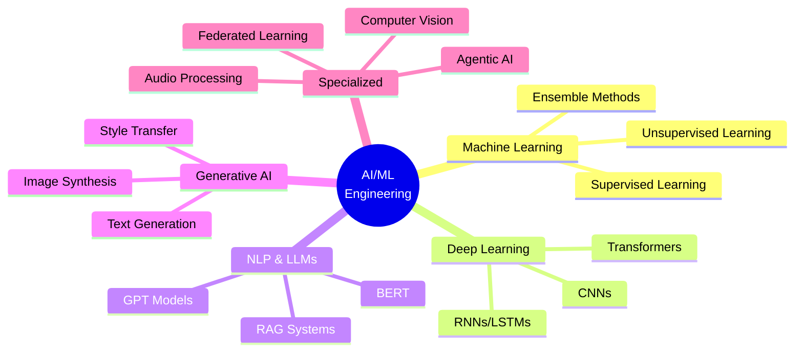

# Hi there, I'm Nazmul Islam! 👋

<div align="center">
  
</div>

<h3 align="center">🤖 AI/ML Engineer | 📊 Data Scientist | 🔬 Published Researcher</h3>
<h4 align="center">Building intelligent systems that make a difference 🚀</h4>

<p align="center">
  
  
</p>

---

## 🚀 About Me

```python
class AIEngineer:
    def __init__(self):
        self.name = "Nazmul Islam"
        self.role = "Junior AI Developer"
        self.company = "SM Technology"
        self.location = "Dhaka, Bangladesh 🇧🇩"
        self.languages = ["Python", "C++", "Java", "JavaScript", "SQL"]
      
    def get_education(self):
        return {
            "🎓 Masters": "MSc in IT | JU (CGPA: 4.00/4.00)",
            "🎓 Bachelors": "BSc in IT | UITS (CGPA: 3.94/4.00)",
            "📜 IELTS": "6.5 Overall Band"
        }
  
    def get_specializations(self):
        return [
            "🤖 Generative AI & LLMs",
            "🧠 Deep Learning & NLP",
            "🔐 Federated Learning",
            "👁️ Computer Vision",
            "🤝 Multi-Agent Systems",
            "📊 Data Science & ML"
        ]
  
    def get_research(self):
        return "📄 Published in MDPI Mathematics 2024 (Q1 Journal) ⭐"
  
    def current_work(self):
        return [
            "💼 Building production-ready AI applications",
            "🔬 Researching LLM-based multi-agent systems",
            "🛠️ Creating RAG-powered intelligent assistants",
            "🌟 Contributing to open-source AI projects"
        ]

me = AIEngineer()
print(me.get_research())  # 📄 Published in MDPI Mathematics 2024 (Q1 Journal) ⭐
```

---

## 💼 Professional Highlights

🔹 **Junior AI Developer** @ SM Technology - Developing production-ready AI applications  
🔹 **Research Assistant** @ UITS - Published in Q1 journal (MDPI)  
🔹 **300+ Problems** solved on competitive programming platforms  
🔹 **IELTS Score**: 6.5 Overall  
🔹 **Kaggle Contributor** - Active in AI/ML competitions  

---

## 🛠️ Tech Stack & Skills

### 💻 Programming Languages


### 🤖 AI/ML & Deep Learning


### 📊 Data Science & Analytics


### 🌐 Web Development


### 🗄️ Databases & Cloud


### 🛠️ Tools & Platforms


---

## 🎯 Areas of Expertise



---

## 🏆 Featured Projects

### 🔹 [Agentic Research Pipeline](https://github.com/Nazmul0005)
> Multi-agent system using LangGraph for automated research report generation
- **Tech**: LangGraph, LangChain, OpenAI API, Python
- **Features**: Validation, citations, professional formatting

### 🔹 [Intelligent Gmail Automation Assistant](https://github.com/Nazmul0005)
> AI-powered email management with automated analysis & responses
- **Tech**: OpenAI, FastAPI, React, MongoDB
- **Features**: Smart categorization, context-aware responses

### 🔹 [Custom RAG AI Chatbot](https://github.com/Nazmul0005)
> Enterprise-ready chatbot with semantic & hybrid search
- **Tech**: MongoDB, LangChain, RAG, Vector Search
- **Features**: Context-aware responses, document retrieval

### 🔹 [Twitter-Based Suicide Ideation Detection](https://github.com/Nazmul0005)
> Mental health monitoring using ML/DL models
- **Tech**: BERT, TensorFlow, Scikit-learn, PyTorch
- **Features**: 7 ML models, 4 DL models, custom dataset

### 🔹 [VitaFlex AI](https://github.com/Nazmul0005)
> Personal fitness & nutrition assistant
- **Tech**: OpenAI, Computer Vision, NLP
- **Features**: AI gym coach, meal planner, food analyzer

### 🔹 [Deep Neural Style Transfer](https://github.com/Nazmul0005)
> Artistic style transfer for images, videos & webcam
- **Tech**: TensorFlow, Keras, OpenCV
- **Features**: Real-time processing, multiple style options

---

## 📚 Research Publication

**Privacy-Preserving Federated Learning-Based Intrusion Detection for Cyber-Physical Systems**  
📖 *Mathematics 2024 (MDPI)* - Q1 Journal  
👥 Mahmud, S.A.; **Islam, N.**; Islam, Z.; Rahman, Z.; Mehedi, S.T.  
🔗 DOI: [10.3390/math12203194](https://doi.org/10.3390/math12203194)  
⭐ Federated Learning | Deep Learning | IoT Security | Cybersecurity

---

## 📊 GitHub Statistics

<div align="center">
  
</div>

<div align="center">
  
</div>

---

## 🏅 Achievements & Activities

- 🥇 **300+ Problems** solved on beecrowd platform
- 🎯 **Kaggle Contributor** - AI/ML competitions (NLI, Image Classification, NLP)
- 👨‍💼 **Executive** - Competitive Programming Wing, UITS IT Club (2021-2023)
- 📝 **Published Researcher** - MDPI Mathematics 2024
- 🌐 **IELTS**: 6.5 Overall Band Score
- 🏆 Multiple **Codeforces** contest participations

---

## 💡 What I'm Currently Working On

🔸 Building advanced **multi-agent AI systems** with LangGraph  
🔸 Exploring **large language models** for enterprise applications  
🔸 Developing **RAG-based** intelligent assistants  
🔸 Contributing to **open-source AI/ML** projects  
🔸 Researching **federated learning** applications in real-world scenarios  

---

## 📫 Connect With Me

<div align="center">
  
[](https://linkedin.com/in/nazmul-islam-634642276)
[](https://kaggle.com/nazmulislam005)
[](https://twitter.com/@content904)
[](https://fb.com/content-on-demand)
[](https://instagram.com/@contentondemand904)
[](https://www.youtube.com/c/content-on-demand)
[](mailto:nazmulislam45213@gmail.com)
[](https://my-portfolio-pied-tau-30.vercel.app/)

</div>

---

## 💬 Ask Me About

- 🤖 **Machine Learning & Deep Learning**
- 🧠 **Natural Language Processing & LLMs**
- ⚡ **Generative AI & Prompt Engineering**
- 🔐 **Federated Learning & Privacy-Preserving AI**
- 👁️ **Computer Vision & Image Processing**
- 🤝 **Agentic AI & Multi-Agent Systems**
- 📊 **Data Analysis & Visualization**

---

## 📈 Coding Activity

<!--START_SECTION:waka-->
<!--END_SECTION:waka-->

---

<div align="center">
  
### 🌟 "Transforming ideas into intelligent solutions, one line of code at a time" 🌟


---


**If you find my work interesting, consider giving a ⭐ to my repositories!**


</div>
